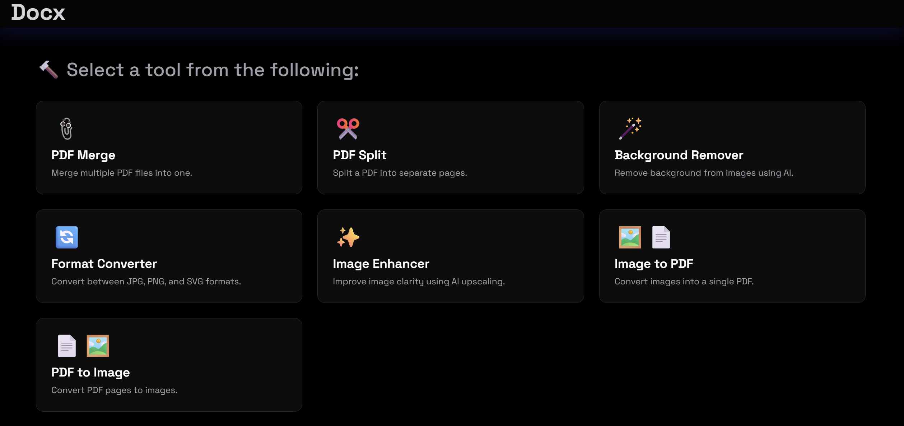

# 🧰 Docx - AI-Powered PDF & Image Toolkit

**Docx** is a powerful and intuitive web application designed to simplify your document and image processing workflows. Whether you're merging PDFs, removing backgrounds from images with AI, or converting file formats, Docx brings all essential tools into one clean, modern interface.

 <!-- Replace with actual screenshot path -->

---

## ✨ Features

🎯 A curated set of utilities for handling documents and images with ease:

- 📎 **PDF Merge**: Merge multiple PDF files into a single document  
- ✂️ **PDF Split**: Split one PDF into separate pages  
- 🪄 **Background Remover**: Remove image backgrounds using AI  
- 🔄 **Format Converter**: Convert between JPG, PNG, and SVG  
- ✨ **Image Enhancer**: Improve image quality using AI upscaling  
- 🖼️ **Image to PDF**: Convert images into a single PDF file  
- 📄 **PDF to Image**: Convert each PDF page into an image  

All tools support drag-and-drop or manual file selection.

---

## 🌐 Live Demo

🚀 Coming Soon...

---

## 🛠️ Tech Stack

| Tech | Usage |
|------|-------|
| **React** | Frontend framework |
| **Tailwind CSS** | Styling and layout |
| **MediaPipe (Selfie Segmentation)** | Background removal AI |
| **JavaScript File APIs** | Client-side file handling |
| **HTML5 Canvas** | Image processing and rendering |

---

## 📂 Project Structure

```
src/
├── components/
│   ├── BgRemover.jsx
│   ├── PdfMerge.jsx
│   ├── PdfSplit.jsx
│   ├── FormatConverter.jsx
│   ├── ImageEnhancer.jsx
│   ├── ImageToPdf.jsx
│   └── PdfToImage.jsx
├── utils/
│   ├── pdf.utils.js
│   └── image.utils.js
├── App.jsx
└── index.js
```

---

## 🧪 Local Development

### Prerequisites

- Node.js ≥ 14
- npm or yarn

### Steps

```bash
# Clone the repository
git clone https://github.com/yourusername/docx-toolkit.git
cd docx-toolkit

# Install dependencies
npm install

# Start development server
npm start
```

Then navigate to `http://localhost:3000`.

---

## 📦 Production Build

```bash
npm run build
```

This creates a minified, production-ready version in the `build/` directory.

---

## 📌 Roadmap

- [ ] Add batch processing support  
- [ ] Add output quality/resolution settings  
- [ ] Drag-and-drop reordering for PDF merge  
- [ ] Mobile responsive tweaks  
- [ ] Export processed results as ZIP

---

## 🙌 Contributing

Contributions are welcome! Please fork the repo, make changes in a branch, and submit a PR.

```bash
# Fork it
git clone https://github.com/yourusername/docx-toolkit.git

# Create your branch
git checkout -b feature/your-feature-name

# Commit your changes
git commit -m "Add: Your Feature"

# Push and create PR
git push origin feature/your-feature-name
```

---

## 🧠 Credits

- [Google MediaPipe](https://google.github.io/mediapipe/)
- [React](https://react.dev/)
- [Tailwind CSS](https://tailwindcss.com/)

---

## 📄 License

This project is licensed under the MIT License. See the [LICENSE](./LICENSE) file for details.

---

## 📬 Contact

Built with ❤️ by [Anuj Belsare](https://linkedin.com/in/anuj-belsare)

Have feedback or feature requests? Open an issue or reach out via [LinkedIn](https://linkedin.com/in/anuj-belsare).
